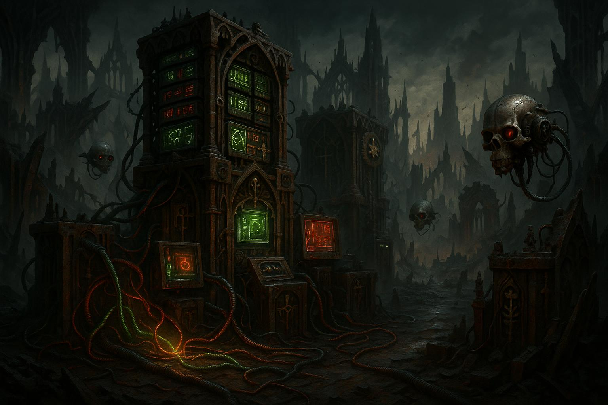

# depot

`depot` is a Warhammer 40,000 companion app powered by [Wahapedia](https://wahapedia.ru)!

A modern monorepo built with pnpm workspaces containing:
- **@depot/cli** - Node.js CLI for processing Wahapedia data
- **@depot/core** - Shared types and utilities
- **@depot/web** - React PWA for browsing game data

## Getting Started

This project uses pnpm workspaces. Install pnpm if you don't have it:

```bash
npm install -g pnpm
```

## Installation

```bash
pnpm install
```

## Data Generation

First, generate data from Wahapedia's CSV exports:

```bash
pnpm cli
# or explicitly
pnpm --filter @depot/cli start
```

This creates `wahapedia.json` in `packages/cli/dist/` - copy this to `packages/web/public/` for the web app.

## Development

Start the web development server:

```bash
pnpm start
```

## Building

Build all packages:

```bash
pnpm build
```

## Testing

```bash
# Run all tests
pnpm test

# Test specific packages
pnpm --filter @depot/cli test
pnpm --filter @depot/web test
```

## Code Quality

```bash
# Format code
pnpm format

# Check formatting
pnpm lint
```

## Package Structure

```
packages/
├── cli/     # @depot/cli - Data processing CLI
├── core/    # @depot/core - Shared types & utilities  
└── web/     # @depot/web - React PWA
```

## Contributors

- **Owner/Maintainer** - [fjlaubscher](https://github.com/fjlaubscher)

## License

depot is free software, and may be redistributed under the terms specified in the [LICENSE](LICENSE.md) file.

---


*Generated by gpt-image-1*